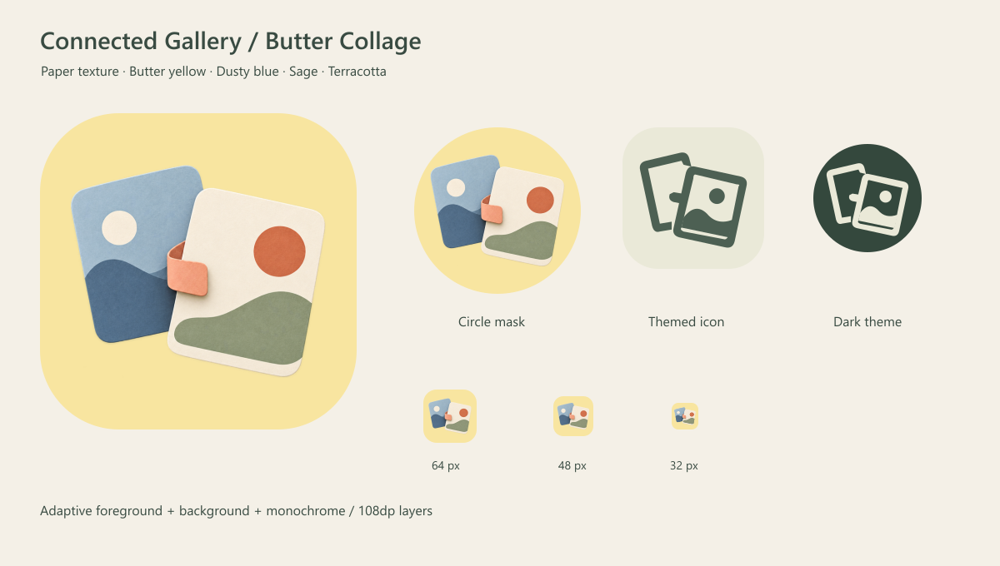

# Connected Gallery — Butter Collage

2026-09-10. 사용자가 선택한 첫 번째 Pinterest 스타일 시안을 적용했다. 버터 옐로 배경, 더스티 블루·아이보리 종이 사진 카드, 세이지 언덕과 테라코타 해, 피치색 연결 탭으로 구성한다.

## 원본과 재생성

- `butter-collage-approved.png`: 사용자가 선택한 원본 시안.
- `butter-collage-foreground.png`: 내장 ImageGen으로 배경만 제거한 투명 전경. 종이 질감 유지.
- `android/app/src/main/res/drawable-nodpi/ic_gallery_paper.png`: 432px 전경 레이어.
- `android/app/src/main/res/drawable/ic_gallery_foreground.xml`: 전경 bitmap drawable.
- `android/app/src/main/res/drawable/ic_gallery_monochrome.xml`: 테마용 단색 벡터. 질감을 단순화한 사진 프레임과 연결 탭.
- 배경색은 `icon_colors.xml`의 `#F8E5A0`.
- `connected-gallery-icon.svg`: 래스터 전경을 포함한 SVG 내보내기. 전경은 벡터가 아니다.
- `connected-gallery-mark.svg`: 단색 벡터 심볼.
- `connected-gallery-icon-512.png`: 512px 마스크 없는 컬러 내보내기.

`node scripts/render-launcher-icon.cjs`로 Android 리소스, SVG/PNG, 검수 이미지와 문서 이미지를 재생성한다. Node.js 및 sharp 필요. 원본 PNG와 스크립트를 함께 보관한다. 단색 도형은 스크립트의 monoPaths가 원본이다.

배경은 런처 마스크에 맞도록 단색 전체 레이어로 분리했다. 전경은 108dp 캔버스 중앙에 배치하며, 원형·둥근 사각형과 64/48/32px로 시각 검수했다. 실제 테마 색상과 마스크는 런처가 결정한다. [Android 적응형 아이콘 가이드](https://developer.android.com/develop/ui/compose/system/icon_design_adaptive)를 참고했다.

## 생성 지시와 검증

내장 ImageGen 사용. 선택 시안 지시: “Warm butter-yellow squircle. Two overlapping softly rounded paper photo cards, one dusty powder blue, one warm cream, tilted slightly in opposite directions, physically connected by a small sculptural peach folded tab. Front card has a very simple terracotta sun and one flowing sage-green hill. Tactile cut-paper edges with extremely subtle shadows, balanced asymmetry, restrained editorial collage, charming but adult, strong silhouette.”

전경 추출 지시: 선택 시안의 카드·색·각도·질감·연결 탭은 유지하고 노란 배경만 투명 알파로 제거.

이번 결과물은 `outputs/android-icon/connected-gallery-butter-debug.apk`에 보관한다. 기기 설치는 이번 작업에서 수행하지 않았다. 이전 아이콘의 기기 설치 기록과 APK 해시는 현재 결과에 해당하지 않는다.

검증: assembleDebug 및 lintDebug 통과. 앱 Lint 오류 0개, 경고 6개. APK SHA-256: EF67E1C18F57A4BABA4FDA103F2BB214B2B331C4403FBBC894093ACAC458B1DF.
