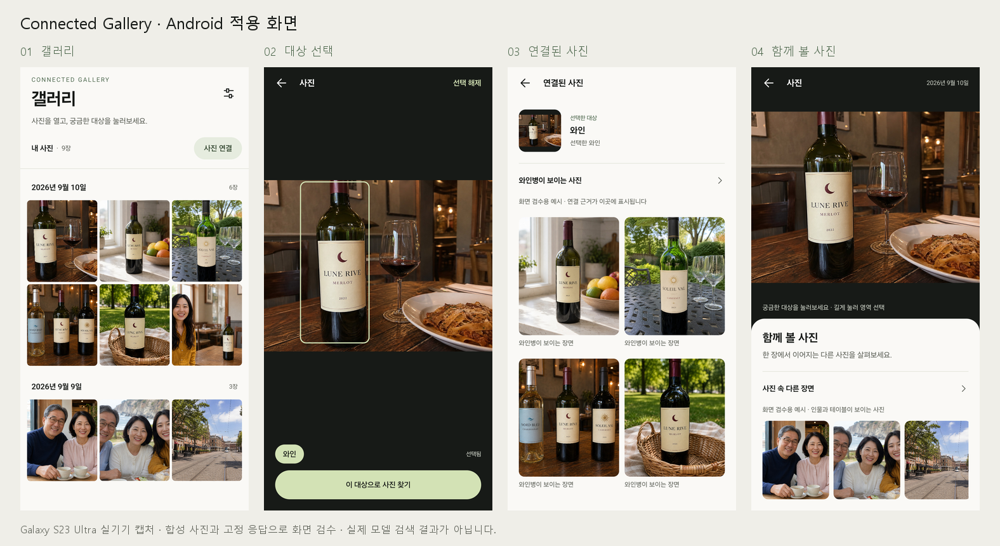

# Android 디자인 적용 · 2026-09-10

후속 시안의 아이보리·차콜, SUIT 한글, 홈/날짜별 분리와 모션은 [2026-09-11 구현·검증 기록](android-paper-ink-2026-09-11.md)을 참고한다. 아래는 초기 화면 적용 당시의 기록이다.

승인된 Connected Gallery 시안의 화이트·세이지 색상과 사진 중심 구성을 Android Compose 화면에 적용했다.



합성 사진과 고정 응답을 사용하는 Galaxy S23 Ultra의 실제 Compose 화면이다. 화면 검수용 제목·날짜·연결 결과를 실제 모델의 판단 결과로 해석하지 않는다.

## 화면과 동작

- 갤러리: 앱 이름과 갤러리 제목, 사진 연결 버튼, 날짜별 3열 사진 그리드. 폭 600dp 이상에서는 5열로 표시한다. 서버 연결·새로고침·샘플 추가·오픈소스 안내는 상단 설정 메뉴에서 접근한다.
- 날짜: 촬영 출처와 시간대가 확인된 날짜만 Asia/Seoul 기준으로 분류한다. 수정일·알 수 없는 출처·시간대 없는 값은 촬영일로 표시하지 않는다. 합성 데모 날짜는 synthetic-demo 기기 조건을 확인한다.
- 대상 선택: 사진을 탭하면 세이지 색 선택 영역과 대상 이름을 보여준다. **이 대상으로 사진 찾기**를 눌렀을 때 기존 Connect 요청을 실행한다. 선택 취소나 뒤로 가기는 검색을 시작하지 않는다. 길게 누르기, 수동 영역 크기 조절, 여러 대상 선택과 인물 이름 지정은 유지한다.
- 연결 결과: 원본 사진의 작은 미리보기, 선택 대상, 서버가 반환한 제목·근거, 두 열의 사진을 표시한다. 전체 그룹 보기와 부분 결과·실패 재시도를 제공한다.
- 자동 맥락: 큰 사진 아래에 함께 볼 사진과 근거를 표시한다. 준비 중·없음·실패·오프라인 상태를 구분하고 재시도를 제공한다. 넓은 화면에서는 사진과 맥락을 나란히 표시한다.
- 이전 사진·검색 결과·그룹·스크롤의 복원은 기존 Journey를 사용한다. 선택만 취소할 때는 탐색 기록을 변경하지 않는다.

## 앱 아이콘


세이지 배경에 겹친 사진 프레임과 풍경을 배치했다. 일반 아이콘과 원형 아이콘은 같은 적응형 리소스를 사용하며, 지원 런처에서는 별도의 단색 레이어를 사용한다. 미리보기의 마스크와 테마 색은 검수용 예시다. 아이콘은 Android 벡터에서 SVG·PNG로 내보내며, [원본과 재생성 안내](../assets/branding/README.md)에 경로와 명령을 기록했다.

## 검증

- `assembleDebug testDebugUnitTest lintDebug` 통과. 단위 테스트 32개, 실패·오류 0개. Lint 오류 0개, 기존 경고 6개.
- Galaxy S23 Ultra SM-S918N / Android 16에서 기존 PhotoCanvas 좌표·확대·지연 영역 로딩 테스트 3개 통과.
- 같은 기기에서 자동 맥락과 연속 탐색·뒤로 복원, 실패 후 재시도, 검색 전 선택 취소, 주요 화면 렌더링, 320×560dp 및 글꼴 배율 1.5의 수동 선택 테스트 5개 통과.
- 주요 화면 PNG 4장과 큰 글꼴 PNG 1장을 실제 Compose 화면에서 캡처해 확인했다. 최초 검수에서 사진 연결 버튼의 기본 보라색을 세이지로 교체하고, 테스트 자산 목록에 섞인 Android 기본 아이콘을 제외했다. 탭 테스트는 Telephoto의 이중 탭 판별 대기가 끝나 선택 화면이 나타난 뒤 진행한다.
- 최종 디버그 APK의 샘플 사진 24장 포함을 확인했다. 화면 검수용 PC 데모 사진은 androidTest 자산에만 들어가며 최종 앱 APK에는 포함되지 않는다.
- 최종 APK를 SHA-256으로 대조한 뒤 연결 기기에 `install -r`로 설치했다. 기존 앱 데이터를 유지했다.

화면 검수는 저장소의 합성 사진과 고정 응답 저장소를 사용했다. 실제 모델의 연결 정확도나 개인 사진의 end-to-end 분석 품질을 새로 검증한 결과는 아니다.

## 전달 파일

최신 전달본은 **화면과 새 아이콘을 모두 포함한 APK**다.

| 전달본 | 로컬 APK | 크기 | SHA-256 |
|---|---|---|---|
| 화면 + 새 아이콘 · 최신 | `outputs/android-icon/connected-gallery-icon-debug.apk` | 47,030,812 bytes | `c3755471cbb0fafef3c597c2f2ff6b39e89910d57e1f7e8886767c1214ace208` |
| 화면 적용 · 이전 아이콘 | `outputs/android-design/connected-gallery-design-debug.apk` | 46,605,192 bytes | `bcf0b87324586520c0ba2c2c1447cf9374a2a7fdcaab2f3fe17ce937db6d18a7` |

아이콘 변경 후 `:app:assembleDebug :app:lintDebug`를 다시 실행해 통과했고, Lint 오류 0개·기존 경고 6개를 확인했다. Galaxy S23 Ultra의 애플리케이션 정보에서 새 아이콘을 확인한 뒤 최종 APK를 해시 대조와 함께 설치했다. 아이콘 변경은 리소스 변경이며, 위 단위·기기 UI 테스트 수치는 화면 구현 검증 기록이다.

개별 화면과 원본 실행 로그는 로컬 `outputs/android-design/`, 아이콘 빌드 로그와 기기 캡처는 `outputs/android-icon/`에 보관한다. APK와 전체 로그는 Git에서 제외한다. 저장소에는 소스·UI 테스트·아이콘 자산과 합성 사진으로 구성한 문서용 미리보기 2장을 보존한다.

## 재현

```powershell
.\android\gradlew.bat -p android assembleDebug testDebugUnitTest lintDebug
.\android\gradlew.bat -p android :core-ui:connectedDebugAndroidTest :feature-explore:connectedDebugAndroidTest
```

두 번째 명령은 연결된 Android 기기가 필요하다. `GalleryDesignDeviceTest`는 기존 `assets/demo-gallery/images/`의 JPG만 선택하고 고정 저장소 응답으로 화면을 검수한다. 개인 갤러리나 모델 API를 사용하는 테스트가 아니다. 기록된 APK 해시는 당시 전달본 식별용이며, 새 빌드의 바이트 동일성을 보증하지 않는다.
