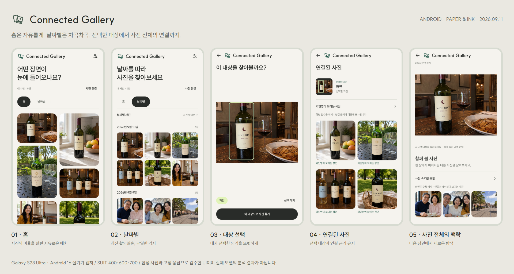

# Connected Gallery · Paper & Ink 구현과 실기기 검증

승인된 브라우저 시안을 Android Compose 앱에 적용했다. **Pinterest식 배치는 홈에만 사용하고 날짜별 정렬은 별도 탭으로 분리**했다.



Galaxy S23 Ultra SM-S918N / Android 16에서 캡처한 실제 앱 구성 요소다. 문서용 화면은 합성 사진과 고정 저장소 응답을 사용한다. 화면의 날짜·관계·근거는 검수 예시이며 실제 모델의 판단 결과가 아니다.

## 화면

- **홈**: 날짜 제목 없이 높이가 다른 사진을 두 열에 배치한다. 원본의 가로세로 비율을 반영하고 정사각 사진에는 시안의 다양한 프레임 비율을 적용한다. 폭 600dp 이상에서는 세 열이다.
- **날짜별**: 촬영일 제목 아래 세 열의 정사각 격자를 사용한다. 날짜가 최신인 그룹부터 보여주고, 촬영일이 불명확한 사진은 마지막에 따로 표시한다. 폭 600dp 이상에서는 다섯 열이다. 기존 날짜 출처·Asia/Seoul 변환 규칙을 유지한다.
- **복원**: 홈과 날짜별 탭의 스크롤을 각각 보존한다. 사진을 보고 돌아와도 선택한 탭과 위치를 유지하며, 저장된 화면 상태 복원도 검증했다.
- **브랜드**: 갤러리와 상세·검색 화면에 Connected Gallery 제목과 기존 겹친 사진 심볼을 표시한다. 버터 콜라주 런처 아이콘을 유지한다.
- **선택·검색**: 사진의 실제 선택 영역을 연두색 선과 짙은 외곽선으로 표시한다. 검색 결과의 원본 미리보기에도 같은 영역을 표시하여 무엇을 기준으로 찾았는지 유지한다. 검색 결과는 균일한 두 열이다.
- **자동 맥락**: 원본 전체 사진 아래 함께 볼 사진과 근거를 보여준다. 큰 화면의 나란히 보기, 오프라인·실패·빈 결과·재시도, 연속 탐색과 뒤로 가기를 유지한다.

## 색상과 한글

차가운 화면 배경, 전기 파랑 버튼, 따뜻한 사진, 서로 다른 성격의 한글 글꼴이 경쟁하던 구성을 정리했다. 따뜻한 사진과 연결되는 아이보리 바탕에 차콜 글자·버튼을 사용하고, 초록은 연결 근거, 연두는 선택 영역에 사용한다.

| 역할 | 색상 |
|---|---|
| 배경 | `#F5F3EE` |
| 본문·주요 버튼 | `#292C29` |
| 보조 글자 | `#646962` |
| 연결 근거 | `#285B4C` |
| 선택 강조 | `#E2F4B9` |

SUIT를 앱에 포함해 기기 기본 한글 폰트에 따라 인상이 바뀌지 않게 했다. 제목 600, 본문 400, 브랜드 700을 사용한다. [원본 리비전·체크섬·라이선스](../android/core-ui/FONTS.md)를 기록했다. 큰 글꼴에서도 조작 버튼을 표시하고 브랜드는 필요하면 줄바꿈한다.

## 모션

- 홈·날짜별 전환: 180ms 크로스페이드.
- 선택 영역: 180ms로 강조선이 나타난다.
- 선택 대상, 연결 후보, 맥락 응답: 240ms 페이드와 12dp 이동.
- 맥락 상태 영역은 내용 높이 변화를 자연스럽게 연결한다.

모션은 실제 UI 상태와 서버 응답에 연결된다. 브라우저 시안의 합성 타이머·가짜 검색 단계는 앱에 넣지 않았다. 시스템 애니메이션 배율을 따르며, 배율 0에서도 선택과 검색을 완료했다. 검증 후 원래 기기 설정으로 복원했다.

## 검증

2026-09-11, SM-S918N / Android 16:

- `assembleDebug testDebugUnitTest lintDebug` 통과. 단위 테스트 **36개**, 실패·오류 0개. 앱 Lint 오류 0개, 기존 경고 6개.
- `:core-ui:connectedDebugAndroidTest`: 좌표·확대·늦게 도착한 분석의 제스처 테스트 **3개 통과**.
- `:feature-explore:connectedDebugAndroidTest`: **10개 통과**. 홈/날짜 분리, 날짜 순서·미상 날짜, 탭별 스크롤 및 저장 상태 복원, 사진 선택과 결과·맥락·뒤로 가기, 실패·오프라인 복구, 큰 한글 글꼴을 확인했다.
- 시스템 애니메이션 배율 0으로 화면 흐름과 큰 글꼴 선택 테스트 **2개 재실행, 통과**. 320×560dp의 수동 영역 선택과 320×640dp의 갤러리 탭 조작을 검증했다.
- 설치한 실제 앱에서도 기존 사진 로딩, 홈→날짜별→사진 열기→날짜별 복귀→홈 전환을 확인했다.
- 주요 상태의 실기기 PNG 6장을 육안 검수했다. 실제 개인 갤러리 캡처는 로컬 검증 폴더에만 두고, Git 문서에는 합성 사진 화면만 포함한다.

이 기록은 실제 Android 기기에서 수행한 UI·동작 검증이다. 모델의 사진 연결 정확도나 전체 개인 사진 분석 완료를 새로 검증한 결과는 아니다.

## 설치본

최종 APK를 기기에 전송한 뒤 SHA-256을 비교하고 `pm install -r`로 설치했다. 기존 앱 데이터와 서버 설정을 보존했다.

- 전달 APK: 로컬 `outputs/android-paper-ink/connected-gallery-paper-ink-debug.apk`
- 크기: **47,554,195 bytes**
- SHA-256: `ed233e174c7cdae844fb4c7b7c83caf77329f0b8f8d8040963b02ba9e78d54dd`
- 빌드·실기기·모션 축소 로그와 캡처: 로컬 `outputs/android-paper-ink/`.

APK와 원본 로그는 Git에서 제외하고 구현, 폰트·라이선스, 테스트, 문서용 화면을 커밋한다.

```powershell
.\android\gradlew.bat -p android assembleDebug testDebugUnitTest lintDebug
.\android\gradlew.bat -p android :core-ui:connectedDebugAndroidTest :feature-explore:connectedDebugAndroidTest
.\.venv\Scripts\python.exe scripts\install-device.py --adb "$env:LOCALAPPDATA/Android/Sdk/platform-tools/adb.exe"
```
