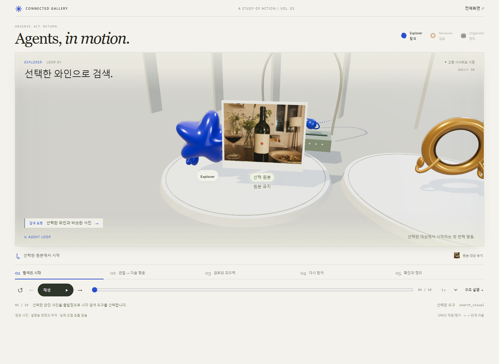
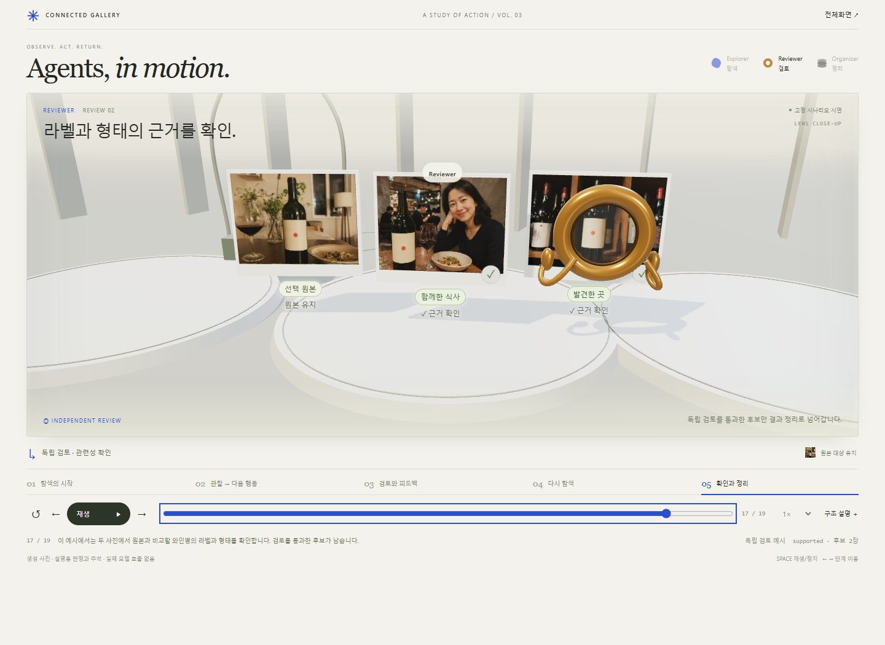

# Agents, in motion

추상 agent가 사진을 직접 집고, 넘겨받고, 검토하고 정렬하는 발표용 시연이다. 파란 유기체는 Explorer, 호박색 렌즈는 Reviewer, 검은 모듈은 결과 Organizer다. 사진과 agent는 두께·회전·그림자를 가진 같은 3D 공간의 물체이며, 카메라는 행동에 맞춰 접근·측면 추적·후퇴한다.

## 실행

이 폴더에서 `./start.ps1`을 실행한 뒤 브라우저에서 `http://127.0.0.1:8893`을 연다. 사용 중인 포트라면 `./start.ps1 -Port 8894`로 바꿀 수 있다. 종료는 터미널에서 Ctrl+C. Python 3가 필요하다. 이전 시연의 8891·8892 버전은 별도로 보존했다.

일반 정적 HTTP 서버에서도 동작한다. ES 모듈을 사용하므로 `index.html`을 파일로 직접 여는 방식은 지원하지 않는다. 모든 이미지와 Three.js 0.170.0을 로컬로 포함하여, 시작 후 외부 네트워크나 모델 키가 필요 없다. Three.js의 MIT 라이선스는 `vendor/THREE-LICENSE.txt`에 있다.

## 발표 조작

- 재생·일시정지: 버튼 또는 Space
- 이전·다음 단계: 버튼 또는 좌우 방향키
- 처음으로: ↺ 버튼 또는 Home
- 장면 선택: 아래 다섯 장면 또는 단계 슬라이더
- 재생 속도: 0.65×, 1×, 1.5×, 2×
- 구조 설명: 내부 loop, 검토 피드백, 종료 조건 펼치기
- 마지막 카메라 후퇴까지 재생한 뒤 정지한다. 완료 후 재생하면 처음부터 시작하고, 마지막 장면 도중 일시정지했다면 그 위치에서 이어간다.
- 다른 탭으로 이동하면 정지한다. 돌아와서 재생 버튼으로 이어갈 수 있다.
- 움직임 축소 설정에서는 자동 시작과 입체 애니메이션을 끈다. 재생·수동 단계 선택은 사용할 수 있다.
- 수동 단계 이동은 읽을 수 있는 완성 구도를 보여준다. 거기서 재생하면 해당 장면의 행동을 처음부터 보여준다. 일반 일시정지 후에는 멈춘 시점에서 이어간다.
- 일시정지 시 카메라, agent, 사진, 전달 표시가 함께 멈춘다. 카메라와 전달 동작은 같은 재생 시간을 사용하며 배속도 함께 적용된다.

## 장면 연출

시작은 높은 전체 구도에서 Explorer로 다가간다. Explorer는 원본을 들어 보고 요청 조각을 검색 장치에 넣는다. 장치에서 올라온 후보를 뻗은 그리퍼로 잡아 펼친다. 운반 중 그리퍼 끝과 사진 모서리가 함께 이동하고, 놓은 뒤 분리된다. 하단 설명은 후보 ID·점수 또는 실제 이미지라는 응답 종류를 구분하며 받은 관찰을 다음 행동 선택에도 유지한다.

전달 장면은 낮은 측면에서 Explorer와 사진을 따라간다. 검토에서는 다른 cast를 프레임에서 제외하고, Reviewer가 사진을 가까이 끌어당겨 기울이며 원본→후보를 살핀다. 후보별 판정은 확인 뒤 나타난다. 호박색 피드백은 Explorer로 돌아와 수정 요청에 들어간다. 수정 검색을 실행하기 전에는 새 후보를 보여주지 않는다. Organizer의 검은 모듈이 펼쳐져 확인된 사진을 받치고, 마지막에는 카메라가 뒤로 올라가며 장면을 마친다. 좁은 화면에서는 후보를 위아래로 배치하여 사진 크기를 확보한다.

운반 동작은 장면 시간의 30~78%, 놓기는 78~94% 구간을 사용한다. 검토와 최종 카메라에는 별도 동작 곡선이 있다. 모든 움직임은 하나의 재생 시간으로 계산하며, 완성 구도와 실행 중 구도는 구분된다. 실제 행동의 시간 길이가 아니라 설명을 위한 안무다.

## 시연과 실제 구현의 관계

고정된 19단계 설명용 시나리오이며 실제 실행 기록이나 내부 사고가 아니다. 기존 발표의 생성 사진 여섯 장을 재사용한다. 사진별 판정·검색 결과·진행 시간은 예시이다. 서버·Android 코드 및 개인 사진을 변경하거나 접근하지 않는다.

`server/connected_gallery/agent_runtime/runner.py`의 model → tools → model 왕복을 파란 요청·응답 전달로 표현한다. 첫 검색, 이미지 확인, 재검색, 새 이미지 확인으로 네 번의 왕복을 보여준다. 제출 응답을 합하면 탐색 모델 응답 여섯 번에 대응하는 예시이다.

독립 검토의 귀환은 `review`와 `after_review`의 조건부 분기를 표현한다. 처음 제출한 후보가 모두 미지원이고 결과가 불완전하며 원본 대상이 유효하고 남은 응답·도구 예산이 있을 때 한 번 재탐색한다. 모든 검토가 재탐색을 유발하지 않는다.

결과 Organizer는 `result_organizer`가 주입된 구성을 의미하며 폐기된 Spaces 역할이 아니다. 최종 관계는 예시이며, 실제 실행은 부분 결과·빈 결과·실패로도 끝날 수 있다.

## 시각 자산

- `assets/gallery.png`: 기존 `connected-gallery-pitch.html`의 `.photo` 생성 이미지 원본을 변경 없이 추출.
- `assets/concept.png`: 이 작업에서 사용자가 승인한 생성 이미지. WebGL 미지원/실패 시 대체 화면.
- `scene.js`에서 사진의 앞면·옆면·프레임, agent와 그리퍼, 요청 조각, 장치, 작업대, 조명을 만든다. HTML은 사진 이름과 상태를 읽기 쉽게 붙이는 캡션에만 사용한다.
- 사진의 판정과 확인 표시는 설명용 주석이며, 실제 모델의 검출 결과가 아니다.

이전 명제와 증거는 [agent-loop-proposition.md](../../agent-loop-proposition.md)와 [agent-loop-cinematic-proposition.md](../../agent-loop-cinematic-proposition.md)에 보존했다. 현재 개정은 [agent-loop-embodied-proposition.md](../../agent-loop-embodied-proposition.md)에서 확인한다. 실험의 기술적 검증을 관객의 감상이나 이해도 증거로 대체하지 않는다.

## 검증 재현

시연 서버를 실행한 상태에서 저장소 루트의 `node scripts/verify-agent-loop.cjs http://127.0.0.1:8893`을 실행한다. 검증 환경에는 Node.js, Playwright 패키지와 Microsoft Edge가 필요하다. Playwright가 별도 경로에 있다면 `NODE_PATH`로 지정한다. 기본 산출물은 Git에서 제외된 `work/agent-loop-validation/`이다. 주소와 출력 디렉터리는 첫 번째·두 번째 인자로 바꿀 수 있다. 검증은 19단계 의미, 6개 화면 폭, 실제 투영된 사진 크기, 그리퍼 접촉과 운반, 일시정지, 마지막 장면 이어보기와 카메라 후퇴를 확인한다. 저사양 환경에서는 그림자 렌더링으로 실행이 더 걸릴 수 있다.
