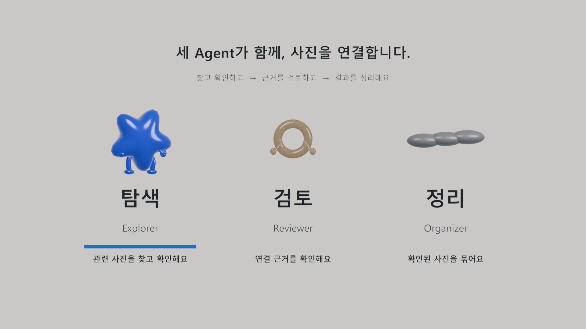
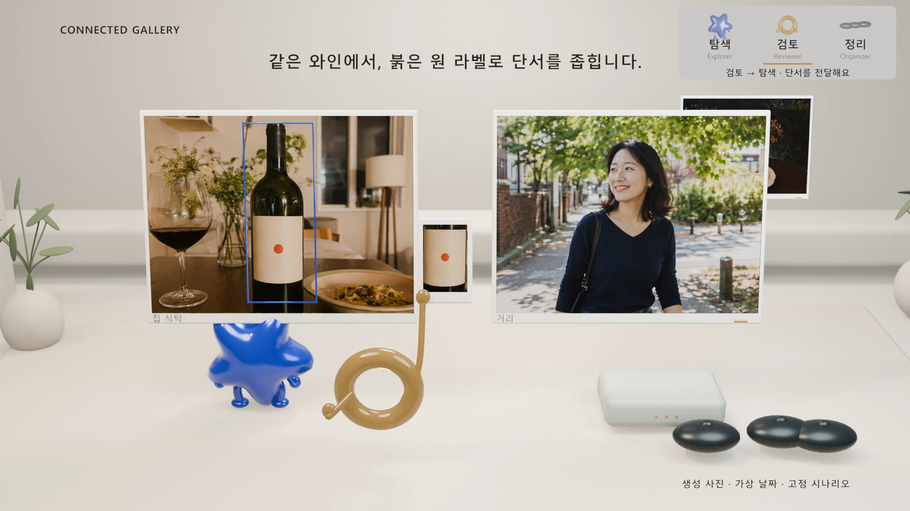

# v3 제작 확인 — 2026-09-10

100초·1920×1080·24fps의 최종 MP4를 생성했다. 파일 크기는 37,198,964바이트다. 검사는 이 파일과 함께 보관한 3D 안내 장면·편집 원본을 대상으로 한다.

## 확인한 내용

- 장면 검사: 원본 v2 MP4·3D 파일의 해시가 유지된다. 전체 2,400프레임에서 담당 표시와 문구를 확인했다. 본편 2,136프레임에서 안내판이 사진 프레임·자막의 투영 영역과 겹치지 않는다. 쉬는 심볼은 회전각을 유지한다. 크레딧 구간에는 안내 요소가 없다.
- 매체 검사: H.264 2,400프레임, 100초, 1920×1080, 24fps 및 AAC 음원 트랙을 확인했다. 전체 RGBA 프레임을 읽어 소개 배경·구석 표시 범위·마지막 투명 구간을 확인했다.
- 전달 검사: 최종 합성 Blender 파일을 다시 열어 v2 MP4·2,400개 안내 프레임의 상대 경로와 음원 시작 프레임 169를 확인했다. 안내 원본에서 사용하는 맑은 고딕 두 글꼴이 포함돼 있다.

각 결과는 [장면](scene-validation.json), [매체](media-validation.json), [전달](delivery-validation.json) JSON에 기록했다.

## 화면 검수와 수정

초안 소개의 영어 이름과 설명 간격을 넓혔다. 뒤편에 놓인 사진 위쪽과 안내판이 가까워지는 구간을 보고 안내판을 458×156픽셀 범위로 줄였고, 한글 이름과 상태 문구를 유지했다. 둥근 모서리를 적용했다. 상태 전환의 초 단위 반올림 때문에 발생하던 한 프레임 차이는 공통 프레임 경계를 사용하도록 수정했다.

28초 프리뷰를 브라우저에서 재생해 소개에서 구석으로 이동하는 중간 화면과 첫 재탐색 장면을 확인했다. 최종 MP4에서도 별도로 대표 프레임을 디코딩해 소개, 축소 이동, 검토, 피드백, 정리와 크레딧을 확인했다. 최종 파일의 브라우저 재생에서는 1920×1080, 재생 길이 100.01초, 65.1초 시점의 진행과 오류 없음 상태를 확인했다. 아래 이미지는 최종 인코딩된 MP4에서 추출했다.

이 검사는 형식·가시성·타이밍 및 제작 과정에서 직접 본 화면에 대한 기록이다. 실제 관객 이해도나 사용자 최종 승인을 측정한 결과는 아니다. 기존 고정 시나리오의 모델 성능이나 모든 장면의 의미적 정확성을 새로 평가하지 않았다.
